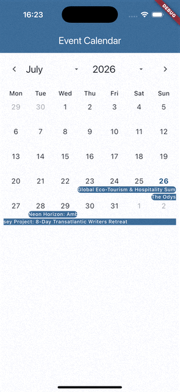

# Flutter Calendar

Building a Material 3 themeable event calendar widget.

Photo by Chandan Chaurasia on Unsplash

## Why Build a Calendar in Flutter?

Flutter Material 3 still lacks an official, fully featured event calendar widget. This often leads developers to rely on large third-party packages. Our goal was to build a simple, robust, customizable calendar.

To achieve this, we use standard Flutter widgets wherever possible. This avoids reinventing the wheel, reduces unnecessary complexity, and benefits from Flutter's built-in optimisations.

We also focused on making the widget fully themeable. It integrates seamlessly with Flutter's Material 3 theming and adapts to your app's existing design system and color scheme.

### UX/UI

Events are displayed as bars spanning their scheduled dates, with the event title shown inside. Each day is divided into vertically scrollable time slots, making the interface mobile friendly.

This layout provides a clear visual representation of each event's timeframe, makes overlapping events easy to identify, and allows users to quickly understand their schedule at a glance.



## Data Model

We start by defining a clear interface contract so our calendar component knows what data to expect from every custom event class, regardless of its implementation.

```dart
abstract interface class CalendarEvent {
  String get id;
  DateTimeRange get dates;
  String get title;
  String get description;
}
```

## Event Lanes

To preserve visual continuity and readability, events are assigned a consistent lane throughout their duration. This keeps each event in the same position across multiple days and week rows.

This function builds a map of calendar dates to event lanes. `null` placeholders buffer overlapping events, ensuring events stay in their respective lanes in every grid cell.

```dart
Map<DateTime, List<CalendarEvent?>> _getEventLaneMap() {
  final sortedEvents = List<CalendarEvent>.from(widget.events)
    ..sort((a, b) => a.dates.start.compareTo(b.dates.start));

  final map = <DateTime, List<CalendarEvent?>>{};
  if (sortedEvents.isEmpty) return map;

  DateTime? clusterEndDay;
  final clusterDays = <DateTime>{};
  int maxLaneInCluster = 0;
  final laneEnds = <DateTime>[];

  void padCluster() {
    for (final day in clusterDays) {
      final dayLanes = map[day]!;
      while (dayLanes.length <= maxLaneInCluster) {
        dayLanes.add(null);
      }
    }
  }

  for (final event in sortedEvents) {
    final startDay = DateTime(
      event.dates.start.year,
      event.dates.start.month,
      event.dates.start.day,
    );
    final endDay = DateTime(
      event.dates.end.year,
      event.dates.end.month,
      event.dates.end.day,
    );

    if (clusterEndDay != null && startDay.isAfter(clusterEndDay)) {
      padCluster();
      clusterDays.clear();
      laneEnds.clear();
      maxLaneInCluster = 0;
    }

    if (clusterEndDay == null || endDay.isAfter(clusterEndDay)) {
      clusterEndDay = endDay;
    }

    int laneIndex = laneEnds.indexWhere(
      (endTime) => startDay.isAfter(endTime),
    );

    if (laneIndex == -1) {
      laneEnds.add(endDay);
      laneIndex = laneEnds.length - 1;
    } else {
      laneEnds[laneIndex] = endDay;
    }

    if (laneIndex > maxLaneInCluster) {
      maxLaneInCluster = laneIndex;
    }

    for (
      DateTime day = startDay;
      !day.isAfter(endDay);
      day = DateTime(day.year, day.month, day.day + 1)
    ) {
      clusterDays.add(day);

      final dayLanes = map.putIfAbsent(day, () => <CalendarEvent?>[]);

      while (dayLanes.length <= laneIndex) {
        dayLanes.add(null);
      }

      dayLanes[laneIndex] = event;
    }
  }

  padCluster();

  return map;
}
```

## Event Tile

We use `GridView` because it's an effective way to build grid layouts in Flutter using familiar, optimized widgets. At the same time, we want event titles to span multiple days and week rows.

To achieve this, we render the title in every day cell an event occupies and shift it horizontally by the day index multiplied by the day width. This creates the appearance of one continuous title.

```dart
Widget _buildEventTile({
  required BuildContext context,
  required DateTime day,
  required CalendarEvent event,
  required double eventWidth,
  required double eventHeight,
}) {
  final theme = Theme.of(context);
  final dayIndex =
      DateTime(day.year, day.month, day.day)
          .difference(
            DateTime(
              event.dates.start.year,
              event.dates.start.month,
              event.dates.start.day,
            ),
          )
          .inDays;
  final textOffset = dayIndex * eventWidth;
  final isFirstDay = DateUtils.isSameDay(event.dates.start, day);
  final isLastDay = DateUtils.isSameDay(event.dates.end, day);
  final isSingleDay = isFirstDay && isLastDay;

  return Tooltip(
    padding: const EdgeInsets.all(8),
    margin: const EdgeInsets.all(8),
    decoration: BoxDecoration(
      color: theme.colorScheme.inverseSurface,
      borderRadius: BorderRadius.circular(8),
    ),
    richMessage: TextSpan(
      children: [
        TextSpan(
          text: '${event.title}\n',
          style: theme.textTheme.titleSmall?.copyWith(
            color: theme.colorScheme.onInverseSurface,
          ),
        ),
        WidgetSpan(child: const SizedBox(height: 8)),
        TextSpan(
          text: '${DateFormat.yMMMd().format(event.dates.start)} - '
              '${DateFormat.yMMMd().format(event.dates.end)}\n',
          style: theme.textTheme.bodySmall?.copyWith(
            color: theme.colorScheme.onInverseSurface,
          ),
        ),
        WidgetSpan(child: const SizedBox(height: 8)),
        TextSpan(
          text: event.description,
          style: theme.textTheme.bodySmall?.copyWith(
            color: theme.colorScheme.onInverseSurface,
          ),
        ),
      ],
    ),
    preferBelow: false,
    child: Container(
      clipBehavior: Clip.hardEdge,
      height: eventHeight,
      decoration: BoxDecoration(
        color: theme.colorScheme.primary,
        borderRadius: isSingleDay
            ? BorderRadius.circular(8)
            : isFirstDay
                ? const BorderRadius.horizontal(left: Radius.circular(8))
                : isLastDay
                    ? const BorderRadius.horizontal(right: Radius.circular(8))
                    : null,
      ),
      child: Transform.translate(
        offset: Offset(-textOffset, 0),
        child: Align(
          alignment: Alignment.centerLeft,
          child: Text(
            event.title,
            style: theme.textTheme.labelSmall?.copyWith(
              color: theme.colorScheme.onPrimary,
              height: 1,
            ),
            maxLines: 1,
            softWrap: false,
            overflow: TextOverflow.visible,
          ),
        ),
      ),
    ),
  );
}
```

## Calendar Grid

With the event lane map in place, building the calendar becomes straightforward. We iterate over the month days generated earlier and render each one using a seven-column `GridView`.

Since lane positions are already determined and empty lanes are buffered by `null` placeholders, we can simply render each day's events in a `Column` and fill empty lanes with `SizedBox`.

```dart
Widget _buildCalendarGrid(
  BuildContext context,
  List<DateTime> days,
  Map<DateTime, List<CalendarEvent?>> eventMap,
) {
  return GridView.builder(
    shrinkWrap: true,
    physics: const NeverScrollableScrollPhysics(),
    gridDelegate: const SliverGridDelegateWithFixedCrossAxisCount(
      crossAxisCount: 7,
    ),
    itemCount: days.length,
    itemBuilder: (context, index) {
      final day = days[index];
      final isToday = DateUtils.isSameDay(day, DateTime.now());
      final isCurrentMonth = day.month == _currentDate.month;
      final dayEvents = [
        ...(eventMap[DateTime(day.year, day.month, day.day)] ??
            const <CalendarEvent>[]),
      ];
      final theme = Theme.of(context);
      final dateColor = isCurrentMonth
          ? (isToday
              ? theme.colorScheme.onPrimaryContainer
              : theme.textTheme.bodyLarge?.color)
          : theme.disabledColor;

      return InkWell(
        onTap: () {
          Navigator.of(context).push(
            MaterialPageRoute(
              builder: (_) {
                final events = dayEvents.whereType<CalendarEvent>().toList();
                return CalendarDay(
                  date: day,
                  events: events,
                  onTapEvent: widget.onTapEvent,
                );
              },
            ),
          );
        },
        child: Column(
          children: [
            Center(
              child: Text(
                '${day.day}',
                style: theme.textTheme.bodyLarge?.copyWith(
                  color: dateColor,
                  fontWeight: isToday ? FontWeight.bold : null,
                ),
              ),
            ),
            if (dayEvents.isNotEmpty)
              Expanded(
                child: LayoutBuilder(
                  builder: (context, constraints) {
                    final dayHeight = constraints.maxHeight;
                    final eventWidth = constraints.maxWidth;
                    final eventHeight =
                        (dayHeight - (dayEvents.length - 1) * 2) /
                        dayEvents.length;

                    return Column(
                      spacing: 2,
                      children: [
                        for (var event in dayEvents)
                          if (event != null)
                            _buildEventTile(
                              context: context,
                              day: day,
                              event: event,
                              eventWidth: eventWidth,
                              eventHeight: eventHeight,
                            )
                          else
                            SizedBox(height: eventHeight),
                      ],
                    );
                  },
                ),
              ),
          ],
        ),
      );
    },
  );
}
```

## Day View

Implementing the `CalendarDay` view is relatively straightforward. We draw a vertical hour grid inside a `SingleChildScrollView`, creating a mobile-friendly interface with a clear visual representation of time.

We use `Stack` to position event tiles over the hour grid based on their time spans. Each tile displays the event title and description, and handles user interaction through the `onTapEvent` callback.

```dart
Widget _buildEventTile({
  required BuildContext context,
  required CalendarEvent event,
  required double eventWidth,
  required int index,
}) {
  final theme = Theme.of(context);
  final isStartDay = DateUtils.isSameDay(event.dates.start, date);
  final startHourDecimal = isStartDay
      ? event.dates.start.hour + (event.dates.start.minute / 60.0)
      : 0.0;

  final isEndDay = DateUtils.isSameDay(event.dates.end, date);
  final endHourDecimal = isEndDay
      ? event.dates.end.hour + (event.dates.end.minute / 60.0)
      : 24.0;

  final isSingleDay = isStartDay && isEndDay;

  final top = startHourDecimal * hourHeight;
  final left = index * (eventWidth + 2);

  final height =
      ((endHourDecimal - startHourDecimal).clamp(0.5, 24.0)) * hourHeight;

  final formattedDateTime =
      '${DateFormat.MMMd().add_j().format(event.dates.start)} - '
      '${DateFormat.MMMd().add_j().format(event.dates.end)}';

  return Positioned(
    top: top,
    left: left,
    child: InkWell(
      onTap: () {
        onTapEvent?.call(event);
      },
      child: Container(
        height: height,
        width: eventWidth,
        clipBehavior: Clip.hardEdge,
        padding: const EdgeInsets.all(8),
        decoration: BoxDecoration(
          color: theme.colorScheme.primaryContainer,
          borderRadius: isSingleDay
              ? BorderRadius.circular(8)
              : isStartDay
                  ? const BorderRadius.vertical(top: Radius.circular(8))
                  : isEndDay
                      ? const BorderRadius.vertical(bottom: Radius.circular(8))
                      : null,
        ),
        child: OverflowBox(
          alignment: Alignment.topLeft,
          maxHeight: double.infinity,
          child: Column(
            crossAxisAlignment: CrossAxisAlignment.start,
            mainAxisAlignment: MainAxisAlignment.start,
            mainAxisSize: MainAxisSize.min,
            children: [
              Text(
                event.title,
                style: theme.textTheme.titleSmall?.copyWith(
                  color: theme.colorScheme.onPrimaryContainer,
                ),
              ),
              const SizedBox(height: 8),
              Text(
                formattedDateTime,
                style: theme.textTheme.bodySmall?.copyWith(
                  color: theme.colorScheme.onPrimaryContainer,
                ),
              ),
              const SizedBox(height: 8),
              Text(
                event.description,
                style: theme.textTheme.bodySmall?.copyWith(
                  color: theme.colorScheme.onPrimaryContainer,
                ),
              ),
            ],
          ),
        ),
      ),
    ),
  );
}
```

## Putting It All Together

Our `Calendar` widget `build` method is surprisingly simple. We generate the calendar days based on the current date, then render the header and calendar grid.

When the displayed month or year changes, we call the `onChanged` callback with the current date range. When a day is tapped, we push a new route containing `CalendarDay` with its respective events.

```dart
Widget build(BuildContext context) {
  final firstDayOfMonth = DateTime(_currentDate.year, _currentDate.month, 1);
  final daysInMonth = DateUtils.getDaysInMonth(
    _currentDate.year,
    _currentDate.month,
  );

  final days = <DateTime>[];
  final firstWeekday = firstDayOfMonth.weekday;

  for (int i = 1; i < firstWeekday; i++) {
    days.add(firstDayOfMonth.subtract(Duration(days: firstWeekday - i)));
  }

  for (int i = 0; i < daysInMonth; i++) {
    days.add(DateTime(_currentDate.year, _currentDate.month, i + 1));
  }

  while (days.length % 7 != 0) {
    days.add(DateTime(days.last.year, days.last.month, days.last.day + 1));
  }

  final eventLaneMap = _getEventLaneMap();

  return Padding(
    padding: const EdgeInsets.all(8),
    child: Column(
      children: [
        _buildHeader(context),
        const SizedBox(height: 16),
        _buildWeekdayLabels(context),
        const SizedBox(height: 8),
        _buildCalendarGrid(context, days, eventLaneMap),
      ],
    ),
  );
}
```

## Using the Calendar

You simply define a dedicated class implementing our calendar event interface. Then, instantiate the calendar within your scaffold body alongside chronological date constraints.

```dart
class MyEvent implements CalendarEvent {
  // Implementation details here
}

Calendar<MyEvent>(
  events: myEvents,
  startDate: DateTime.now(),
  startYear: 2020,
  endYear: 2030,
  onChanged: (range) => fetchEvents(range),
  onTapEvent: (event) => showEventDetails(event),
)
```

## Conclusion

Building a custom calendar gives you complete control over rendering and user experience. It perfectly adapts to your theme without unnecessarily bloating your project dependencies or relying on external packages.
